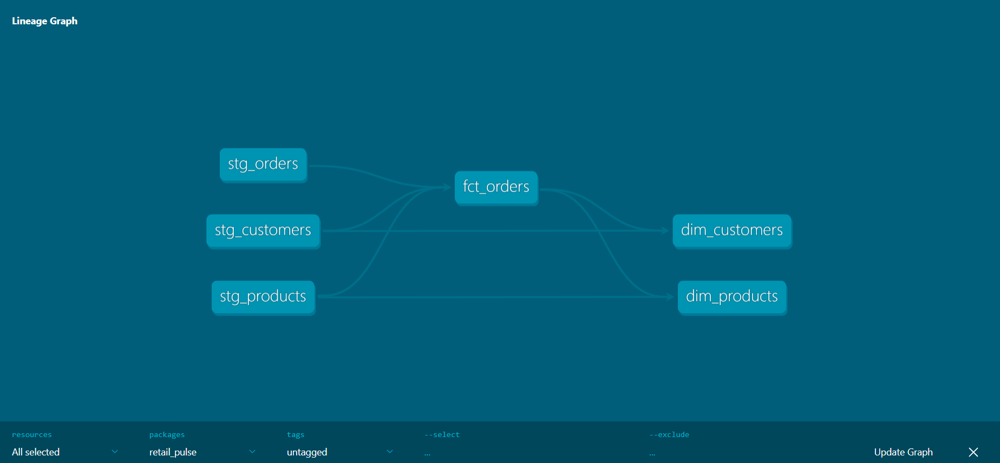
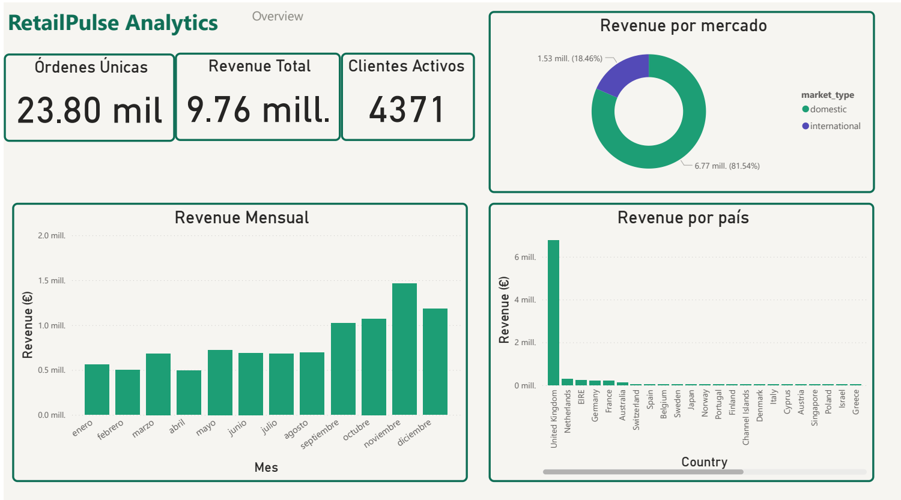
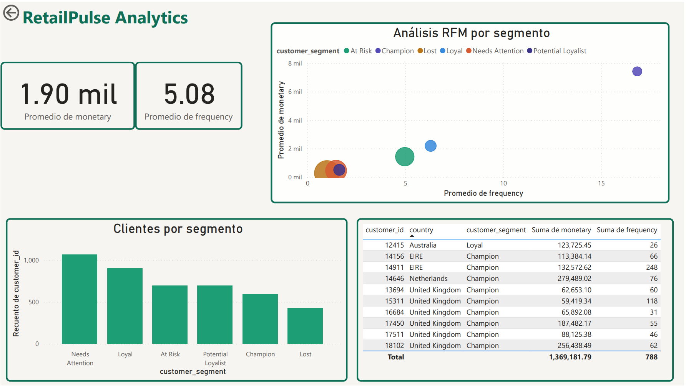
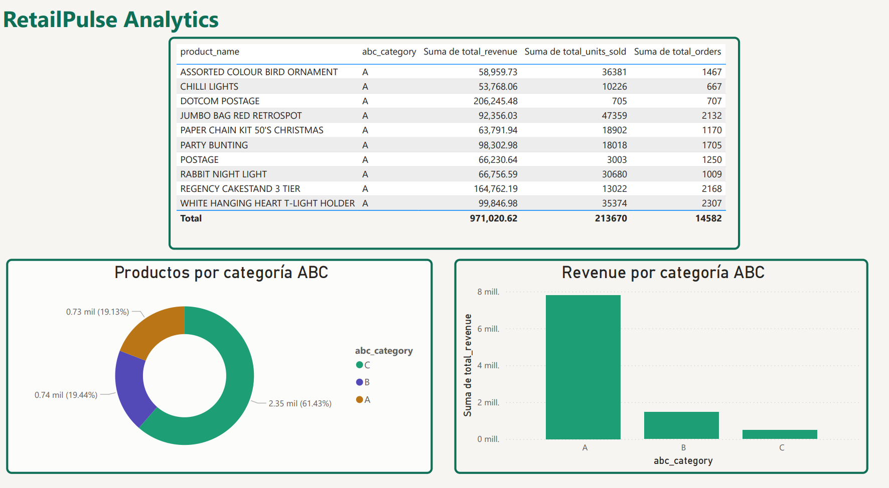

# RetailPulse Analytics

Pipeline de analítica end-to-end sobre datos de e-commerce, construido con un stack moderno de datos: Python, SQL Server, dbt y Power BI.

## Problema de negocio

Una empresa de retail con operaciones en 38 países tiene más de 500,000 transacciones históricas pero no tiene visibilidad sobre:
- Qué clientes generan el 80% del revenue
- Qué productos vale la pena mantener en catálogo
- Cómo evoluciona el revenue mes a mes

Este proyecto construye el pipeline completo desde los datos crudos hasta un dashboard ejecutivo que responde esas preguntas.

## Arquitectura

| Capa | Herramienta | Descripción |
|---|---|---|
| Ingesta | Python + pandas | Extracción, limpieza y carga del dataset crudo |
| Almacenamiento | SQL Server | Esquema relacional con constraints y foreign keys |
| Transformación | dbt | Modelos staging y marts con tests de calidad |
| Análisis | Python + Jupyter | EDA, segmentación RFM y análisis ABC |
| Visualización | Power BI | Dashboard ejecutivo con 3 páginas |

## Dashboard

### Overview

### Análisis de clientes

### Análisis de productos

## Hallazgos principales

- El **81.5%** del revenue proviene del mercado doméstico (Reino Unido)
- El revenue creció **3x** entre enero y noviembre de 2011
- Solo el **20% de los productos** (categoría A) genera el **80% del revenue** — confirmando el principio de Pareto
- Los clientes **Champion** tienen un LTV promedio de **£7,430** y compran cada 28 días en promedio
- Solo **591 clientes** (13.5%) son Champions — oportunidad clara de expansión

## Stack técnico

- **Python 3.12** — pandas, SQLAlchemy, pyodbc, matplotlib, seaborn
- **SQL Server Express 2022** — esquema relacional, constraints, DDL profesional
- **dbt 1.11** — modelos staging/marts, tests de calidad, lineage graph
- **Power BI Desktop** — dashboard ejecutivo con 3 páginas
- **Git** — control de versiones con commits semánticos

## Estructura del proyecto

\`\`\`
retail-pulse-analytics/
├── data/
│   ├── raw/                    # Dataset original sin modificar
│              
├── sql/
│   └── schema/                 # DDL con constraints nombradas
├── ingestion/
│   ├── extract.py              # Lectura del CSV
│   ├── transform.py            # Limpieza con pandas
│   ├── load.py                 # Carga idempotente a SQL Server
│   └── utils.py                # Conexión a base de datos
├── dbt/retail_pulse/
│   └── models/
│       ├── staging/            # Limpieza y renombramiento
│       └── marts/              # Modelos de negocio
├── analysis/
│   └── 01_eda.ipynb            # EDA, RFM y análisis ABC
└── dashboard/
    └── retail_pulse.pbix       # Dashboard Power BI
\`\`\`

## Dataset

[UK E-Commerce Data](https://www.kaggle.com/datasets/carrie1/ecommerce-data) — 541,909 transacciones de un retailer del Reino Unido entre 2010 y 2011.

## Autor

**Ivan Mendoza** — [LinkedIn](https://www.linkedin.com/in/iv%C3%A1n-mendoza-ramos-59994239a/) · [GitHub](https://github.com/ivan-menramos)